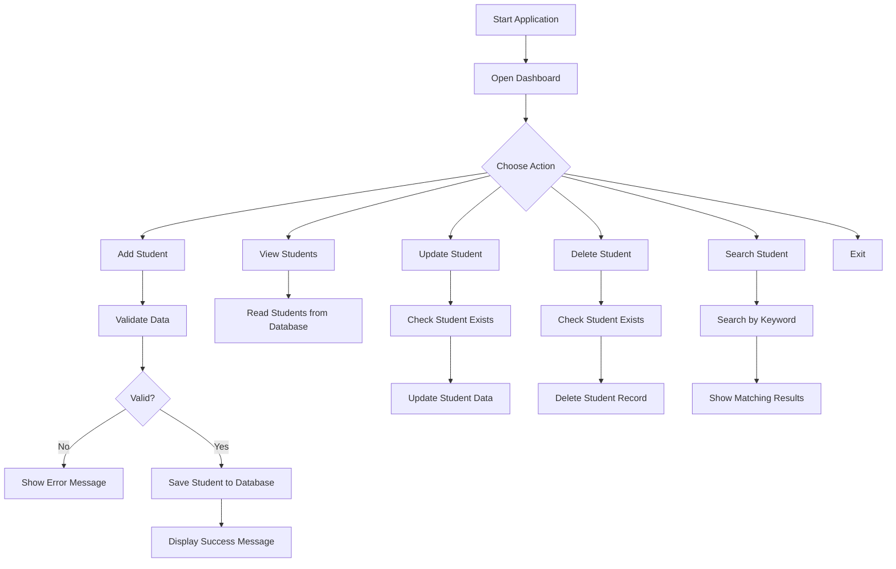
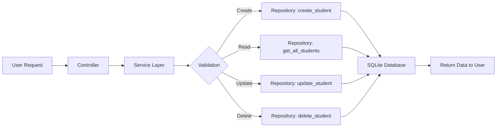
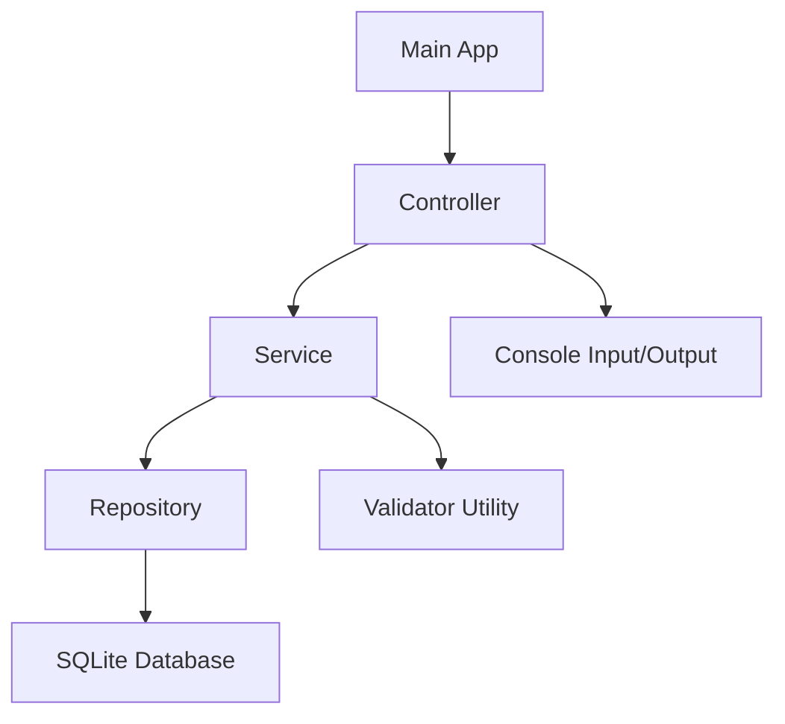
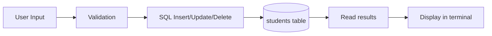

# Project Flow

## Application Flow

```mermaid
flowchart TD
    A[Start Application] --> B[Open Dashboard]
    B --> C{Choose Action}
    C --> D[Add Student]
    C --> E[View Students]
    C --> F[Update Student]
    C --> G[Delete Student]
    C --> H[Search Student]
    C --> I[Exit]
    D --> J[Validate Data]
    J --> K{Valid?}
    K -->|No| L[Show Error Message]
    K -->|Yes| M[Save Student to Database]
    M --> N[Display Success Message]
    E --> O[Read Students from Database]
    F --> P[Check Student Exists]
    P --> Q[Update Student Data]
    G --> R[Check Student Exists]
    R --> S[Delete Student Record]
    H --> T[Search by Keyword]
    T --> U[Show Matching Results]
```

## CRUD Flow

```mermaid
flowchart LR
    A[User Request] --> B[Controller]
    B --> C[Service Layer]
    C --> D{Validation}
    D -->|Create| E[Repository: create_student]
    D -->|Read| F[Repository: get_all_students]
    D -->|Update| G[Repository: update_student]
    D -->|Delete| H[Repository: delete_student]
    E --> I[SQLite Database]
    F --> I
    G --> I
    H --> I
    I --> J[Return Data to User]
```

## Folder Communication Flow

```mermaid
flowchart TD
    A[Main App] --> B[Controller]
    B --> C[Service]
    C --> D[Repository]
    D --> E[SQLite Database]
    C --> F[Validator Utility]
    B --> G[Console Input/Output]
```

## Database Flow

```mermaid
flowchart LR
    A[User Input] --> B[Validation]
    B --> C[SQL Insert/Update/Delete]
    C --> D[(students table)]
    D --> E[Read results]
    E --> F[Display in terminal]
```
